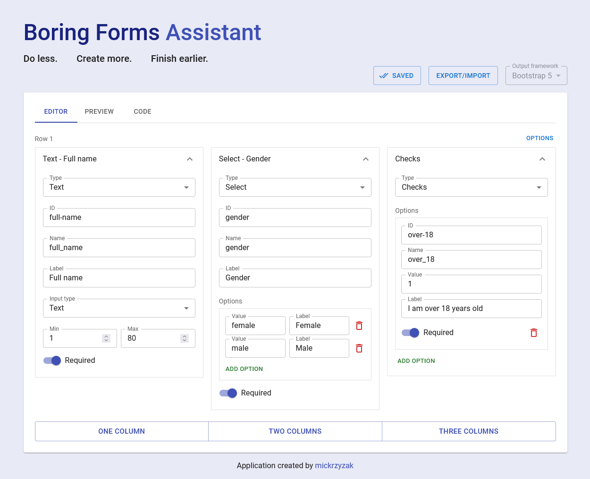

# Boring Forms Assistant

## What is it?

Boring Forms Assistant is a **form builder** that helps you create Bootstrap 5 form structures **faster and easier**. You can import the created data and **modify it at any time**. Code output and **form preview** is avaliable in real time.

### Check it out
[Check out the online demo.](https://mickrzyzak.github.io/boring-forms-assistant/)

### Import the form
[See the registration form ready for import.](examples/registration-form.json)

## Features
- Bootstrap 5 output code
- Live preview
- Grid transformations
- Data saving
- Import/Export

## Field types
- [x] Text *(with variants)*
- [x] Textarea
- [x] Select
- [x] Checkbox
- [x] Radio
- [x] Button

## Built with
- [React](https://github.com/facebook/react)
- [React Redux](https://github.com/reduxjs/react-redux)
- [MUI](https://github.com/mui/material-ui)

## Requirements
- Node.js and npm
- Browser *(Firefox or Chrome recommended)*

## Setup
1. `npm install` Install Node dependencies
2. `npm start` Run the application
